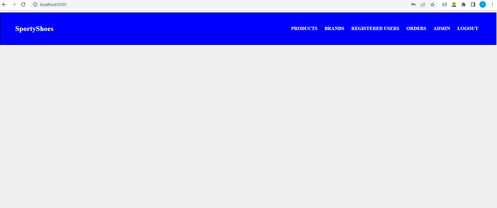

<!-- ABOUT THE PROJECT -->
# Sporty Shoes


## Description

Sporty Shoes is a company that manufactures and sells sports shoes. They have a walk-in store, and now, they wish to launch their ecommerce portal sportyshoes.com.

The admin is able:
* Manage the products in the store including categorizing them
* Browse the list of users who have signed up and be able to search users
* See purchase reports filtered by date and category
* Change password

## Technologies Used

| Java | 1.8 |
| ------ | ------- |
| Spring Boot | 2.7.10 |
| Lombok  | --- |
| JSP | --- |
| MySql | 8 |
| JPA | --- |
| Spring Security Starter | --- | 

## Screenshots





## Installation

You can clone this repository and use it localy:
```sh
$ git clone https://github.com/pedrole/Sporty-Shoes.git
```

**Using Maven plugin**

First you should do clean installation:
```sh
$ mvn clean install
```
You can start application using Spring Boot custom command:
```sh
$ mvn spring-boot:run
```

## Getting started

Initially it created the default admin with Login: ```admin``` Password: ```admin```.

## Roles
**ADMIN** can add, edit and delete products.
**CUSTOMER** can buy products

## Specification Document

[Specification Document](./Specification_Document.pdf)


